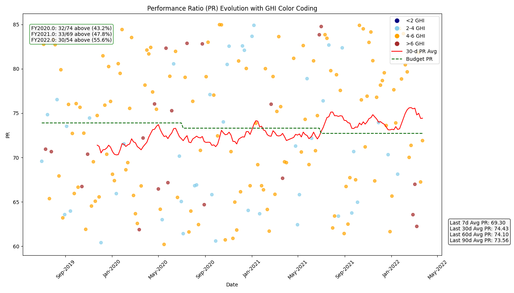

#  Solar PV Performance Analysis & Visualization

## 📌 Problem Statement
Building a data pipeline and visualization system to monitor the Performance Ratio (PR) of a solar PV plant.
---

## Objective

This project aims to create a powerful visualization tool that:
- Tracks the **evolution of PR over time**
- Highlights performance patterns using **color-coded GHI bands**
- Aggregate PR and GHI data from multiple CSV files stored in year-month structured directories.
- Generate a single cleaned dataset with Date, PR, and GHI columns.
- Adds a 30-day moving average of PR as a red line.
- Adds a dynamic target PR (budget) line based on yearly degradation (starting from 73.9% and reducing 0.8% every year).
- Includes a PR summary (last 7/30/60/90/365 days + lifetime average).
- Includes count and % of points above the budget line.
- Accept dynamic start_date and end_date to visualize specific timeframes.

This helps technical teams monitor system health and enables business stakeholders to understand deviations from performance expectations.


## 📈 Output Graph



> **Description**:  
This graph showcases the **Performance Ratio (PR)** over time. Each dot is colored based on the corresponding GHI value:

- 🔵 **< 2 GHI** — Very low sunlight (often cloudy or rainy)
- 🔷 **2–4 GHI** — Moderate sunlight
- 🟠 **4–6 GHI** — Good solar potential
- 🟤 **> 6 GHI** — High sunlight availability

**Key Highlights:**
- 🔴 **Red Line**: 30-day moving average of PR — smooths out short-term fluctuations.
- 🟢 **Dashed Green Line**: Budget PR — expected efficiency considering gradual annual decay.
- 📊 **Box at bottom right**: Summarizes recent average PR values (last 7/30/60/90 days) for executive-level understanding.


## 🧠 Business Understanding & Impact

#### 1.  Performance Trend
- The red 30-day moving average shows a clear improvement from mid-2020 onward.
- PR values stabilize above the budget line from mid-2021, indicating better-than-expected performance.

#### 2.  Impact of GHI on PR
- Scatter color distribution reflects expected weather patterns:
- Lower GHI (blue, navy) typically associates with more dispersed or lower PR points.
- Higher GHI (orange, brown) doesn’t always guarantee high PR — likely due to operational limitations (e.g. clipping, soiling).
- Insight: GHI is a factor, but PR also depends on operational conditions, not just sunlight.

#### 3. Budget Line and Dynamic Degradation
- The green dashed line correctly steps down each fiscal year by 0.8%, modeled dynamically — not hardcoded.
- The red line (PR moving average) is consistently above the green line, showing strong operational performance.

#### 4. Recent PR Health
- The bottom-right text box gives a snapshot of plant efficiency over time:
- Last 30 days PR: 74.43
- Last 90 days PR: 73.56
- These values are very close to or above budget, showing sustained efficiency.

#### Is the Plant Performing Well? = YES

1.PR consistently exceeds the budgeted target.

2.Seasonal variations are normal and well-handled.

3.The performance is stable or improving over time.

## 🛠️ How to Use

```bash
# Run the script to generate the PR graph
python main.py 
